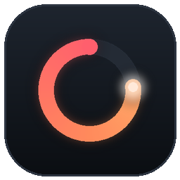
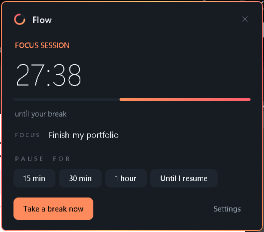
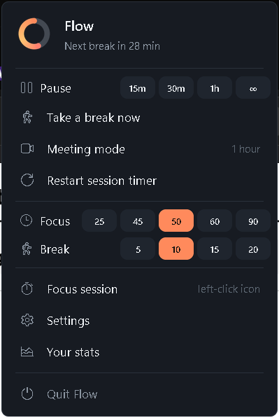
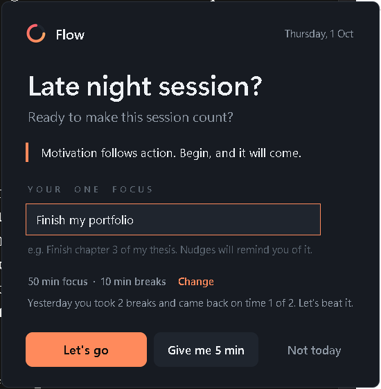
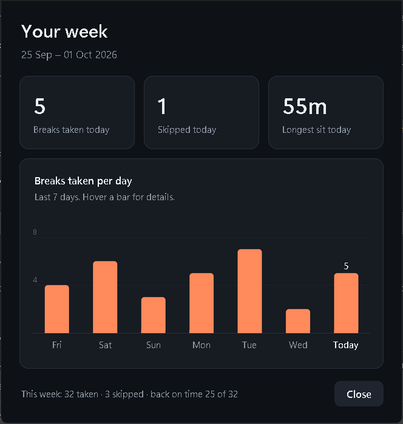
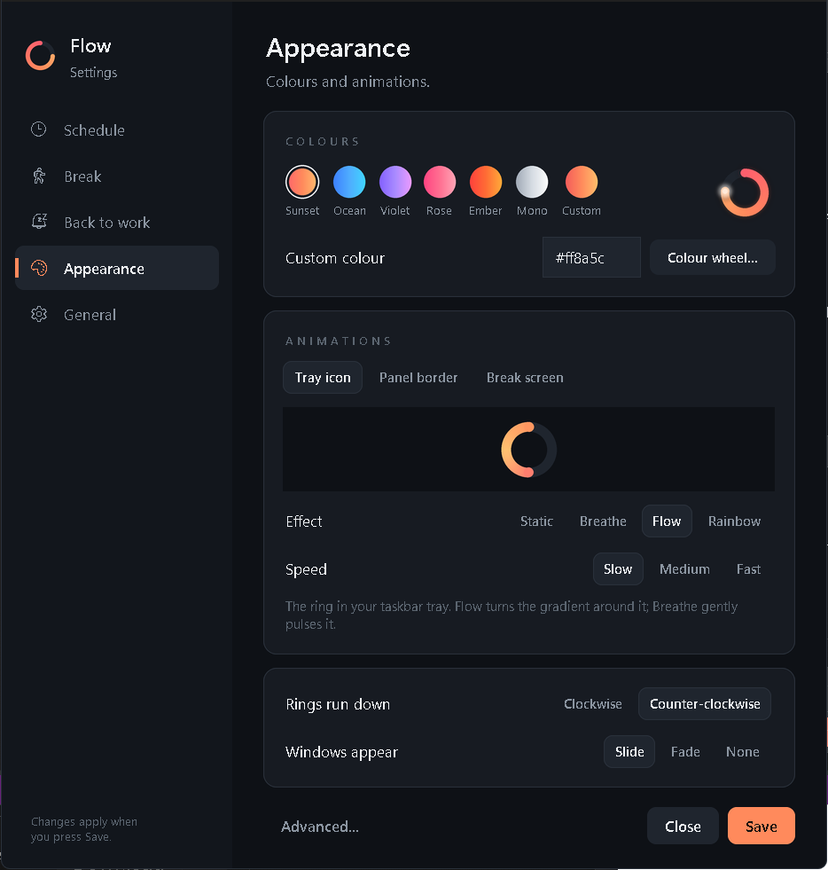
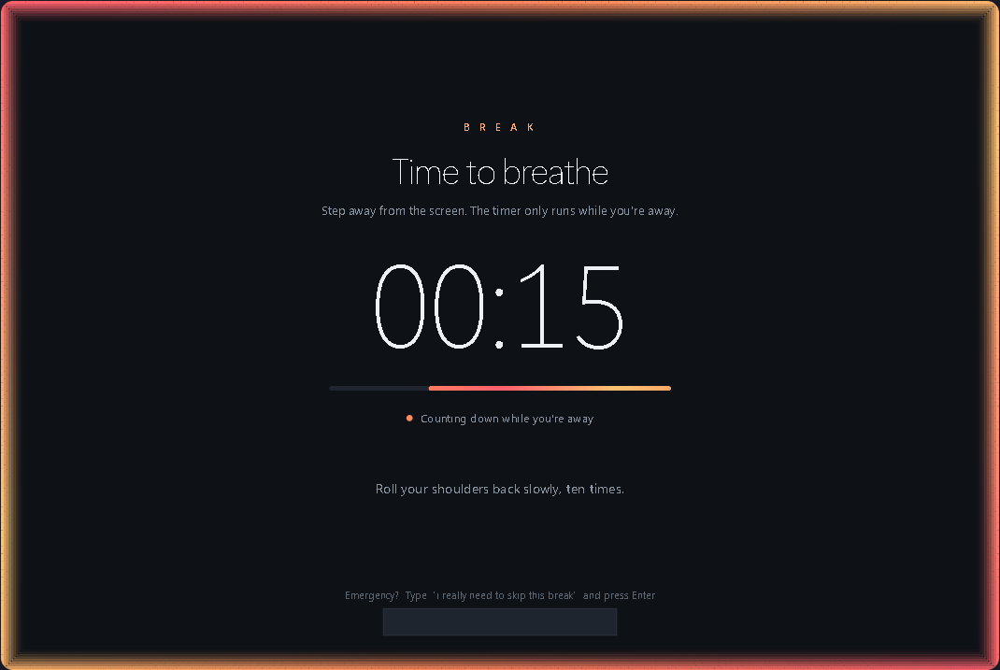

<p align="center"></p>

<h1 align="center">Flow</h1>
<p align="center"><b>Focus in sessions, get up for breaks, and come back ready.</b><br>
A Windows tray app that makes you actually take your breaks.</p>

<p align="center"><a href="https://YOUR-GITHUB.github.io/#projects">▶ Try the live web demo</a></p>

---

Most break reminders are easy to ignore: you click "dismiss" and keep sitting. Flow takes a different approach.
When a break is due, a calm full-screen break screen covers every monitor, and **its countdown only runs while
you're away from the keyboard and mouse**. The only way through a break is to get up.

<p align="center">
  
  
</p>

## Features

- **Focus sessions** with presets (Pomodoro 25/5, Standard 50/10, Deep work 90/15) or your own lengths.
- **Break screen** that covers all monitors and counts down only while you're away. Touching the computer pauses it
  (or, in strict mode, restarts it). An emergency skip phrase is available, and skips are recorded in your stats.
- **Heads-up toast** before a break, with "Break now" or "5 more min".
- **Back-to-work nudges.** If you don't return after a break, Flow reminds you, each time a bit firmer, and can push
  the nudge to your phone through [ntfy](https://ntfy.sh).
- **Smart idle handling.** If the laptop sleeps, that counts as a break. If you're quiet for a while mid-session, Flow
  asks whether it was a break rather than guessing (useful when you're reading or watching a lecture).
- **Welcome card** when you start or wake the laptop, with your one focus for the day and how yesterday went.
- **Meeting mode and pause** (15 min, 30 min, 1 hour, or until you resume).
- **Weekly stats**: breaks taken and skipped, longest sit, and how often you came back on time.
- **Appearance**: six colour themes plus a custom colour wheel, and per-element animations (Static, Breathe, Flow,
  Rainbow) for the tray ring, panel border and break screen.

<p align="center">
  
  
</p>
<p align="center"></p>
<p align="center"><br>
<sub>Break screen, captured from the web demo.</sub></p>

## How it works

| Piece | How |
|---|---|
| UI | Tkinter, with custom widgets (pill buttons, toggles, steppers, tabs, cards) drawn with Pillow and supersampled for smooth edges |
| Tray icon | `pystray`, redrawn as a live timer ring that empties as the session runs down |
| "Are you away?" | Win32 `GetLastInputInfo` through `ctypes`: seconds since the last keyboard or mouse input anywhere in Windows |
| Window chrome | DWM attributes for a dark title bar, rounded corners and border colour on Windows 11 |
| Animations | A gradient that travels around window edges, rendered as a strip and cut into four sides plus curved corners |
| State | A small state machine: `working → break → returning → working`, plus `paused` and `waiting` |
| Data | Settings and stats as JSON in `%APPDATA%\Flow` |
| Startup | `HKCU\...\Run` registry entry, and the tray icon is pinned so it's always visible |
| Sound | A three-note chime synthesised in code and played with `winsound` |

## Run it

Requires Windows 10/11 and Python 3.10+.

```bash
pip install -r requirements.txt
pyw flow.pyw          # normal
pyw flow.pyw --demo   # 1 min sessions / 20 s breaks, for trying it out
```

## Build the .exe

```bash
pip install pyinstaller
pyinstaller --onefile --noconsole --icon flow.ico --name Flow flow.pyw
```

The executable is written to `dist/Flow.exe`.

## Licence

MIT
